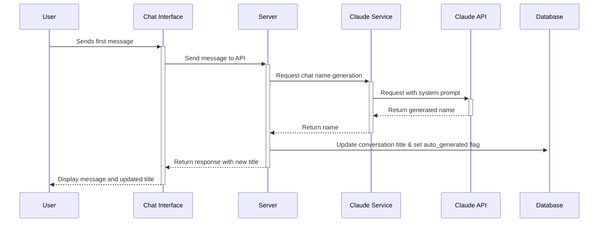
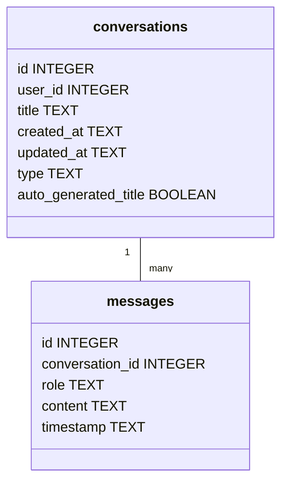
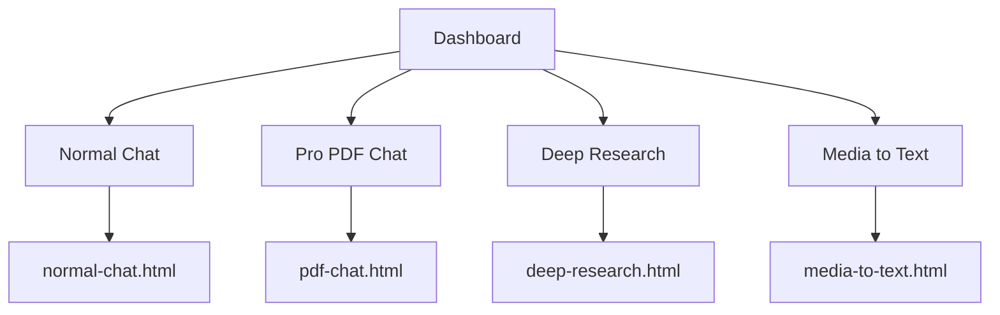

# SuperChat Enhancement Plan

## Overview

This plan outlines the implementation of two main features for SuperChat:

1. **Auto-generated chat names** using Claude 3.5 Haiku
2. **Dashboard redesign** with multiple AI tool options and dedicated pages

## 1. Auto-Generated Chat Names

### Architecture



### Database Changes



### Implementation Steps

1. **Create Name Generation Service**
   - Create a new file: `server/services/name-generator.service.js`
   - Implement function to generate chat names using Claude 3.5 Haiku
   - Design a concise system prompt for short title generation

2. **Modify Database Schema**
   - Add `auto_generated_title` column to conversations table
   - Create migration script for updating existing database

3. **Update Chat Controllers**
   - Modify `chat.controller.js` to check for first message
   - Call name generation service after processing the first message
   - Update conversation title with generated name
   - Return updated title in the response

4. **Update Client-Side Code**
   - Modify `chatInterface.js` to update the chat title when received from server
   - Update UI to display the new title

## 2. Dashboard and Multiple Tools

### Architecture



### Implementation Steps

1. **Create New HTML Pages**
   - Create `normal-chat.html` for normal chat (based on current index.html)
   - Create `pdf-chat.html` for PDF chat (similar to index.html)
   - Create placeholder pages for future tools:
     - `deep-research.html`
     - `media-to-text.html`

2. **Update Dashboard**
   - Redesign `dashboard.html` to display 4 tool cards in a grid layout
   - Create visually distinct cards for each tool with icons and descriptions
   - Update navigation links to point to the new HTML pages

3. **Modify Server Routes**
   - Update server routes to serve the new HTML pages
   - Ensure proper authentication checks on each page

4. **Implement Shared Components**
   - Create shared header/footer/styles across tool pages
   - Implement common JavaScript functionality

## 3. Technical Specifications

### Name Generation Service

```javascript
// server/services/name-generator.service.js
const claudeService = require('./claude.service');

/**
 * Generates a short, descriptive title for a conversation based on the first message
 * @param {string} message - The first message in the conversation
 * @returns {Promise<string>} - The generated title
 */
async function generateChatName(message) {
  const systemPrompt = `
    You are a title generator for chat conversations.
    Generate a very short, concise title (3-5 words) that captures the essence of the user's message.
    The title should be descriptive but brief, and should not use quotes or special formatting.
    Just respond with the title text alone, nothing else.
  `;
  
  try {
    const response = await claudeService.createMessage([
      {
        role: 'user',
        content: `Generate a short title for this conversation: "${message}"`
      }
    ], 'title_generation', { temperature: 0.7, maxTokens: 20 });
    
    // Extract title from response
    let title = response.content[0].text.trim();
    
    // Clean up: remove quotes, limit length
    title = title.replace(/["']/g, '');
    if (title.length > 50) {
      title = title.substring(0, 47) + '...';
    }
    
    return title;
  } catch (error) {
    console.error('Error generating chat name:', error);
    return 'New Chat'; // Fallback title
  }
}

module.exports = {
  generateChatName
};
```

### Database Migration

```javascript
// server/migrations/add_auto_generated_title.js
const db = require('../config/database').db;

function runMigration() {
  console.log('Running migration: add auto_generated_title column');
  
  // Check if the column already exists
  const tableInfo = db.prepare("PRAGMA table_info(conversations)").all();
  const columnExists = tableInfo.some(col => col.name === 'auto_generated_title');
  
  if (!columnExists) {
    // Add the new column
    db.prepare(`
      ALTER TABLE conversations
      ADD COLUMN auto_generated_title BOOLEAN DEFAULT 0
    `).run();
    
    console.log('Added auto_generated_title column to conversations table');
  } else {
    console.log('Column auto_generated_title already exists, skipping');
  }
}

module.exports = {
  runMigration
};
```

### Dashboard Design (CSS Grid Layout)

```css
.tools-grid {
  display: grid;
  grid-template-columns: repeat(auto-fill, minmax(250px, 1fr));
  gap: 1.5rem;
  margin-top: 2rem;
}

.tool-card {
  background-color: var(--bg-light);
  border-radius: 12px;
  box-shadow: var(--shadow);
  transition: transform 0.2s ease, box-shadow 0.2s ease;
  cursor: pointer;
  overflow: hidden;
  display: flex;
  flex-direction: column;
  border: 1px solid var(--border-color);
}

.tool-card:hover {
  transform: translateY(-5px);
  box-shadow: 0 10px 15px -3px rgba(0, 0, 0, 0.1), 0 4px 6px -2px rgba(0, 0, 0, 0.05);
  border-color: var(--primary-color);
}

.tool-header {
  padding: 1.5rem;
  background-color: var(--primary-light);
  color: white;
}

.tool-title {
  font-size: 1.2rem;
  font-weight: 600;
  margin-bottom: 0.5rem;
}

.tool-description {
  color: rgba(255, 255, 255, 0.9);
  font-size: 0.875rem;
}

.tool-body {
  padding: 1.5rem;
  flex-grow: 1;
  display: flex;
  flex-direction: column;
  justify-content: space-between;
}

.tool-icon {
  margin-bottom: 1rem;
  width: 48px;
  height: 48px;
  color: var(--primary-color);
}

.tool-status {
  font-size: 0.75rem;
  margin-top: 1rem;
  padding: 0.25rem 0.5rem;
  border-radius: 12px;
  width: fit-content;
  background-color: var(--bg-medium);
}

.tool-status.available {
  background-color: rgba(74, 222, 128, 0.1);
  color: #4ade80;
}

.tool-status.coming-soon {
  background-color: rgba(251, 146, 60, 0.1);
  color: #fb923c;
}
```

## 4. Implementation Plan

### Phase 1: Auto-Generated Chat Names (3 days)

**Day 1:**
- Create `name-generator.service.js`
- Add the database migration script
- Update conversation controllers to call the name generator

**Day 2:**
- Modify client-side code to handle auto-generated titles
- Test with both normal and PDF chats
- Implement fallback mechanism for failed API calls

**Day 3:**
- Fix any bugs and edge cases
- Optimize performance
- Write documentation

### Phase 2: Dashboard and Tool Pages (4 days)

**Day 1:**
- Create `normal-chat.html` and `pdf-chat.html`
- Create placeholder pages for future tools

**Day 2:**
- Redesign dashboard with tool cards
- Implement navigation between pages

**Day 3:**
- Ensure proper authentication across pages
- Implement shared components and styling

**Day 4:**
- Testing across different devices
- Fix any bugs and edge cases
- Final polish and documentation


